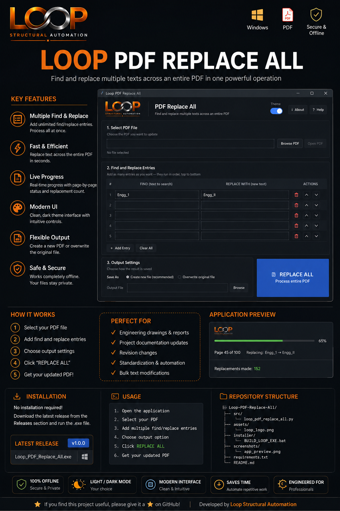

# LOOP PDF Replace All

<p align="center">
  
</p>

<h2 align="center">LOOP PDF Replace All</h2>

<p align="center">
  A desktop PDF text replacement tool for replacing multiple text entries across an entire PDF in one operation.
</p>

---

## 📌 Overview

**LOOP PDF Replace All** is a Windows desktop utility developed by **LOOP Structural Automation** for quickly replacing repeated text throughout a PDF document.

Instead of manually searching and replacing text page by page, the application allows multiple **Find → Replace** entries to be processed across the entire PDF in a single operation.

This is particularly useful for engineering reports, calculation documents, project documentation, revision updates, and other repetitive PDF editing workflows.

---

## ✨ Features

- 🔄 Replace multiple text entries in one operation
- 📄 Process the entire PDF automatically
- ➕ Add multiple Find/Replace entries
- 🗑️ Delete individual replacement entries
- ⬆️⬇️ Reorder replacement entries
- 🧹 Clear all entries
- 📊 Live page-by-page processing progress
- 📋 Replacement summary after processing
- 📁 Create a new output PDF
- 🔁 Option to overwrite the original PDF
- 🌓 Light/Dark mode
- 💾 Theme preference is remembered
- 🖱️ Modern card-based interface
- 📜 Scrollable interface for multiple entries
- 🖼️ LOOP Structural Automation branding
- 📖 Built-in About and Help information

---

## 🖥️ Application

<p align="center">
  
</p>

---

## 🔄 Example

The application can process multiple replacements at the same time.

| Find | Replace |
|---|---|
| `Engg_1` | `Engg_II` |
| `REV-01` | `REV-02` |
| `Project A` | `Project B` |

For example:

```text
Engg_1
